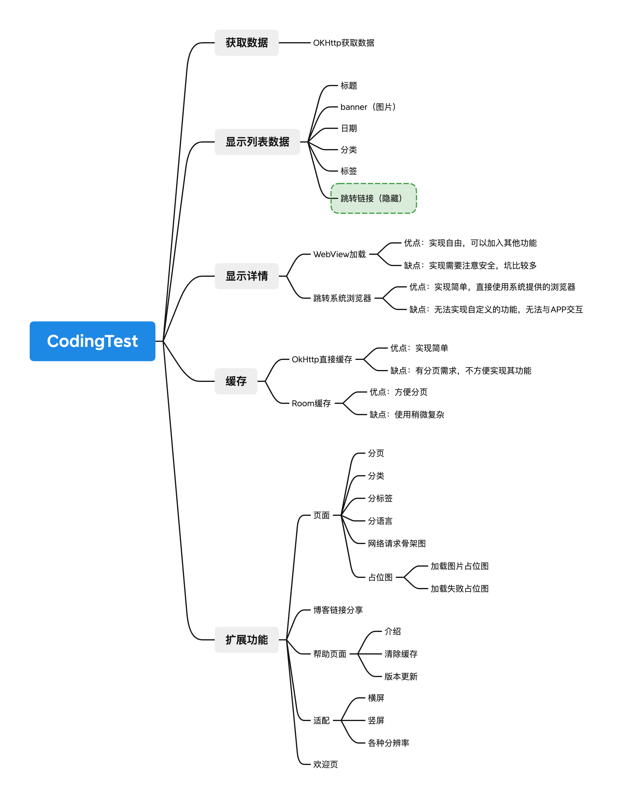
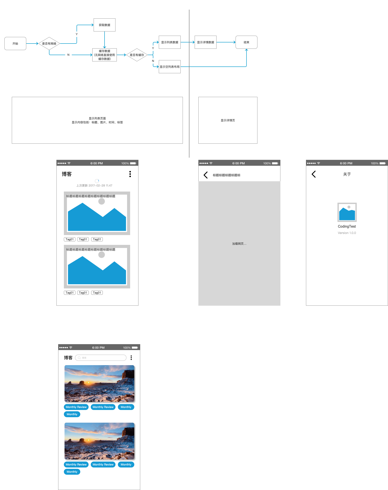

# BLOG

[根据JSON内容实现简单博客列表](https://arcblockio.cn/blog/posts.json)

## 分析

主要功能和需求分析主要是根据`JSON`数据格式。

```json
{
        "frontmatter": {
            "title": "ArcBlock Monthly Highlight for Feb 2022", 
            "banner": {
                "childImageSharp": {
                    "fixed": {
                        "src": "/blog/static/f05dfb3a77ce95aecceadaab43757d49/11382/cover.jpg"
                    }
                }
            }, 
            "date": "2022-02-28", 
            "path": "/blog/en/post/2022/02/28/feb-monthly-review", 
            "categories": [
                "news"
            ], 
            "tags": [
                "Monthly Review"
            ], 
            "language": "en", 
            "draft": null
        }
    }
```



基础需求是正确显示博客列表，博客内容详情。实现分页、离线缓存等功能。

## 原型

简单原型输出，实际上只开发了 **博客列表**一个页面。

后面如果有功能扩展，可以根据需求添加具体内容。



## Build

```
git clone https://github.com/lhzlg3368/Blog.git
```

使用最新`AndroidStuido` 打开 `Blog`，建议使用 `compileSdk=31` 进行编译，目前`compileSdk=32`还有一些问题。

## 代码

使用 `Paging+Room+Retrofit` 实现。应用在网络连接不稳定或用户离线时也可以正常使用，从本地数据库缓存驱动界面，显示更好的体验。相比于使用 `CacheIntercepor` 的方式提供缓存更加简洁和方便。

更多关于 `paging3`的使用 请参考 [link](https://developer.android.com/topic/libraries/architecture/paging/v3-network-db)
